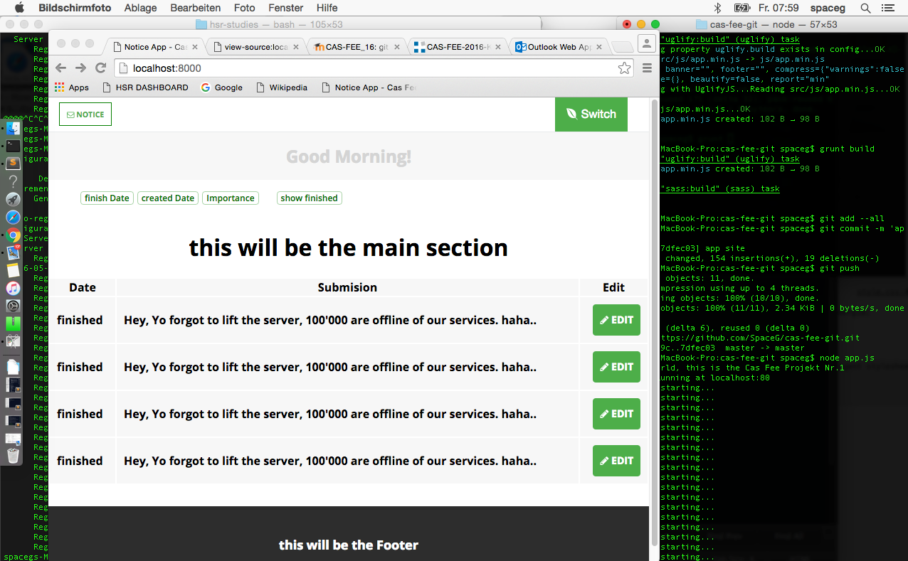

# cas-fee-git
Project HSR - CAS-FEE-Source - http://www.hsr.ch  Switzerland - The Notice App - Using Node.js 

<h1>Get Started with the Cas Fee Git</h1>

This Project is Only built with node.js, grunt.js, sass, javascript and html/css. 

<code>cd cas-fee-git</code>

<code>$ npm install</code>

Run after this <code>grunt build</code>

tasks:

<code>grunt</code>

<code>grunt watch</code>

<code>grunt uglify</code>

<code>$ node app.js</code>

Check your <code>localhost:8000</code>

<h1>Upcomimg Setings!</h1>

- Including js files
- Including less files
- Including Css files
- Including Handlebars
- Including maybe .ejs files 
- Including MongoDB 

